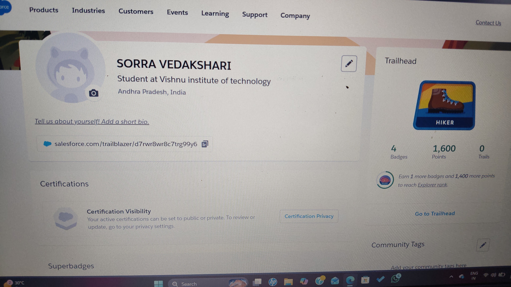

# day-2-platform-basics# Day 2 - Salesforce Platform Basics

## 1. What is Salesforce Platform?

Salesforce Platform is a cloud-based platform that allows 
developers and admins to build and customize business 
applications without always needing to code.
It uses Objects, Apps, and Tabs to organize data.

## 2. App, Object and Tab

### App
An App is a collection of tabs and tools grouped 
together for a specific business purpose.
Example: A "Hospital App" contains Patient, 
Doctor, and Appointment tabs.

### Object
An Object is like a table that stores a specific 
type of data.
Example: Patient Object stores name, age, blood group.

### Tab
A Tab is the navigation button in Salesforce that 
gives users access to an Object.
Example: Clicking "Patient" tab shows all patient records.

## 3. Configuration vs Coding

### Configuration (No Code)
Used for simple tasks without writing code.

Examples:
- Creating a new field in an Object
- Setting up an automatic email alert using Flow

### Coding (Apex)
Used for complex logic that configuration cannot handle.

Examples:
- Calculating commission for multiple sales reps
- Connecting Salesforce to an external payment system

## 4. My System Design

**System: Hospital Management App**

| Part | Details |
|------|---------|
| App Name | Hospital Management App |
| Objects | Patient, Doctor, Appointment, Department |
| User Interaction | Receptionists book appointments, Doctors view patients, Admins monitor departments |

## 5. Screenshots from trailhead
"C:\Users\vedak\OneDrive\Documents\salesforce profile.jpeg"
## 5. Screenshots from Salesforce

  
**Date:** 13 May 2026  
**Day:** Day 2 - Salesforce Platform Basics
